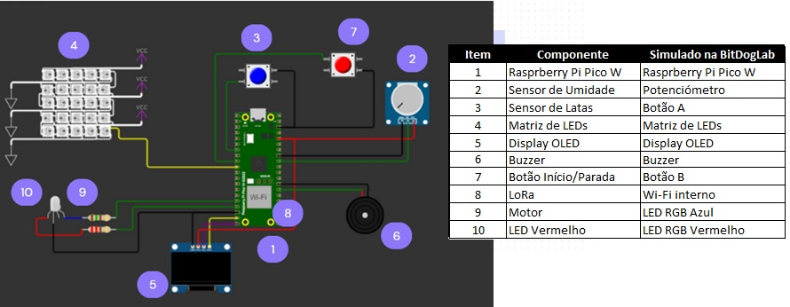

# Passa ou Repassa
# 🚀 Sistema Inteligente de Controle de Esteira para Indústria de Enlatados

Este projeto implementa um **Sistema Inteligente de Controle de Esteira** utilizando o **RP2040 (Raspberry Pi Pico W)**, que ajusta dinamicamente sua velocidade com base na frequência de chegada das latas e no nível de umidade detectado. Ele incorpora tecnologias IoT para comunicação remota e proporciona mais segurança e eficiência na linha de produção.

## 🎯 Funcionalidades

✅ **Sensoriamento Inteligente**
- Sensores de proximidade para detectar a passagem das latas.
- Sensor de umidade para evitar vazamentos e possíveis acidentes operacionais.

✅ **Atuação Automática**
- Ajuste dinâmico da velocidade da esteira com base na demanda da linha de produção.
- Parada automática em caso de excesso de fluxo ou alta umidade.

✅ **Interface e Comunicação**
- **Display OLED** exibe a velocidade, estado da esteira e alertas.
- **Matriz de LEDs** fornece feedback visual sobre o status da operação.
- **Buzzer** emite alertas sonoros em situações críticas.
- **Comunicação via LoRa e UART** para monitoramento remoto.

✅ **Interação Manual**
- Botão físico para iniciar/parar a esteira e simular sensores.

## 🛠 Tecnologias Utilizadas

- **Microcontrolador RP2040** (Raspberry Pi Pico W)
- **Sensores de proximidade e umidade**
- **PWM** para controle de velocidade da esteira
- **Display OLED SSD1306**
- **Matriz de LEDs RGB WS2818B**
- **LoRa e UART** para comunicação IoT
- **Linguagem C** com **Pico SDK**

## ⚙️ Hardware Utilizado

| Componente                | Pino RP2040 (Pico W) |
|---------------------------|----------------------|
| **Sensor de Umidade**      | ADC GPIO27          |
| **Sensor de Latas**        | GPIO5               |
| **Matriz de LEDs**         | GPIO7 (PWM)         |
| **Display OLED SSD1306**   | SDA - GPIO14, SCL - GPIO15 |
| **Buzzer**                 | GPIO21 (PWM)        |
| **Botão Início/Parada**    | GPIO6               |
| **UART**                   | TX - GPIO0, RX - GPIO1 |

## 📜 Estrutura do Código

O código é modularizado e estruturado em:

- **`PassaOuRepassa.c`**: Código principal com configuração do sistema e loop principal.
- **`PassaOuRepassa.pio.h`**: Código PIO para controle dos LEDs WS2818B.
- **`lib/ssd1306.h`** e **`lib/font.h`**: Bibliotecas para manipulação do display OLED.

### 🔹 Principais Blocos do Código

1. **Inicialização do Sistema**
   - Configuração de GPIOs, PWM, I2C, ADC e PIO.
   - Inicialização do display OLED e matriz de LEDs.
   - Configuração de interrupções para sensores e botões.

2. **Leitura de Sensores e Controle da Esteira**
   - Monitoramento da passagem das latas e ajuste da velocidade via PWM.
   - Detecção de umidade e parada crítica caso necessário.

3. **Sinalização e Interface**
   - Atualização da matriz de LEDs conforme o status da esteira.
   - Geração de alertas visuais e sonoros para situações de risco.
   
4. **Comunicação IoT via LoRa**
   - Simulação de transmissão de dados para monitoramento remoto.

## 🚀 Como Rodar o Projeto

### 📌 Pré-requisitos
- **Raspberry Pi Pico W**
- **SDK do RP2040** configurado em seu ambiente de desenvolvimento
- **Compilador ARM GCC** instalado
- **Bibliotecas do Pico SDK e drivers necessários**

### 📌 Compilação e Upload

1. Instale o Pico SDK e configure no VS Code. 

2. Clone este repositório:
   ```sh
   git clone https://github.com/PhD-Anibal/PassaOuRepassa.git
   ```

3. Compile o código, no SDK do VS code aperte em compilar segundo imagem:


4. Conecte seu Raspberry Pi Pico e envie o firmware utilizando o ambiente de desenvolvimento adequado.


## 📎 Esquemático das conexões:
Para ver o esquema de ligações do hardware, acesse o link:
🔗 [Esquemático no Wokwi](https://wokwi.com/projects/423742700160819201)



## 📌 Exemplo de Saída no Display OLED
```
Embarcatech
Velocidade: 5.6 m/s
V. Lata: 0.17
Umid.: 65%
```

## 📜 Licença
Este projeto é de código aberto sob a licença **MIT**.

## 🤝 Contribuições
Sinta-se à vontade para abrir issues e pull requests para melhorias!

📬 **Contato:** Anibal Maldonado - [LinkedIn](https://www.linkedin.com/in/anibal-maldonado/)